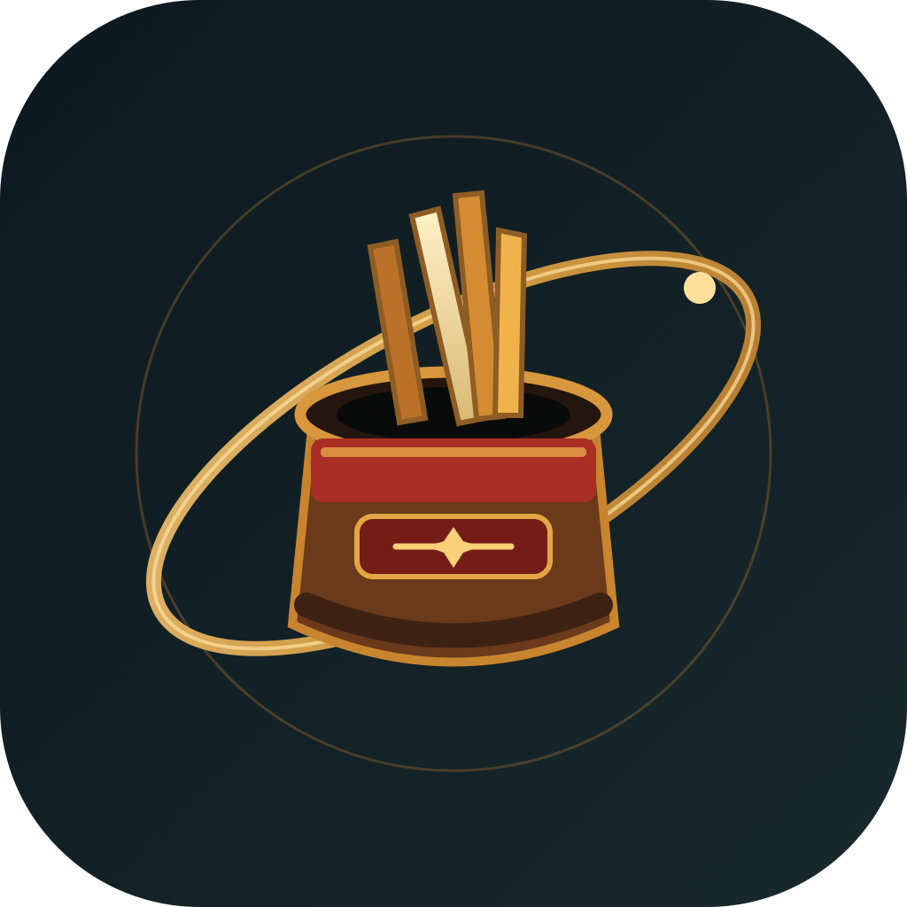

# Orbit

Orbit 是一款将每日命理、自省建议与 Apple 健康节律结合的 iOS App。App 名称取自生活轨迹的概念：用当天真实的状态，帮助用户整理下一步行动。




## 功能

- 离线生成每日命轨、八字、黄历与星座视角的综合解读
- 读取 Apple HealthKit 的步数、睡眠、主动能量、心率和锻炼数据
- 独立的黄大仙求签问卜页面，支持摇晃手机、3D 签筒和掉签动画
- 本地百签库与离线解签兜底
- 可选使用 DeepSeek 生成更具体的文字解读
- 浮动章节导航与结构化的摘要、依据、今日行动布局

## 项目结构

```text
ios/       SwiftUI iOS App，包含本地计算、HealthKit 与求签功能
frontend/  原有 Web 前端
backend/   原有 FastAPI 服务与命理计算模块
docs/      项目截图与文档
```

## iOS 构建

需要 Xcode 16 或更高版本，以及 iOS 18 SDK。

```sh
xcodebuild -project ios/OrbitHealth.xcodeproj \
  -scheme OrbitHealth \
  -sdk iphonesimulator \
  -configuration Debug \
  -derivedDataPath /tmp/orbit-health-build \
  CODE_SIGNING_ALLOWED=NO build
```

在真机上使用 HealthKit 前，需要在 Xcode 中配置签名，并在设备上授权健康数据读取权限。DeepSeek API Key 通过 App 的 Info.plist 配置；没有 Key 时，App 会使用本地解读。

## 说明

命理、签文和健康数据仅用于传统文化与日常自我反思，不构成医疗、财务或事实预测建议。
